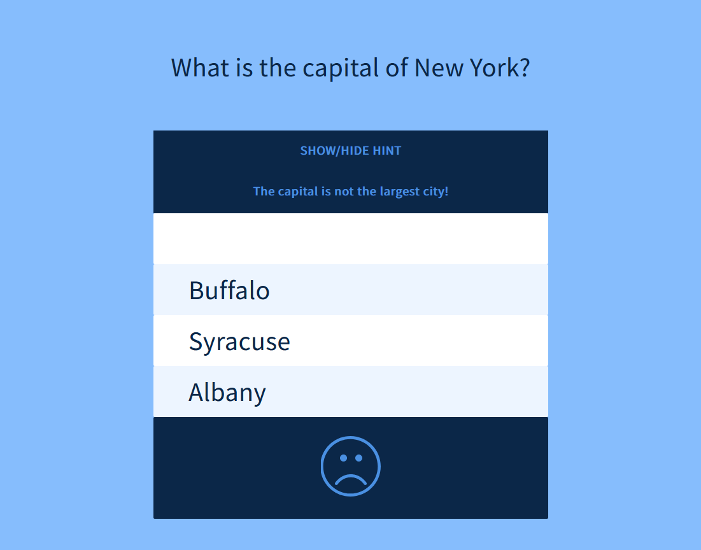

# Trivia Card
In this project, you will follow step-by-step instructions to add jQuery Effects to the Trivia Card on the right. We want the user to be able to read the clue, view an optional hint, and select their answer.

You will add a few different effects. A hint box will slide up and down. When you click an incorrect answer, it will fade away and a frowny face will appear. When you click the correct answer, the frowny face will disappear and a smiley face will take its place.

To complete this project, you must know how to target HTML elements in jQuery, how to create event handlers, and how to use several jQuery Effects methods.

You can preview the starting state of the Trivia Card on the right.

If you get stuck during this project or would like to see an experienced developer work through it, click “Get Unstuck“ to see a [project walkthrough video](https://www.youtube.com/watch?v=-T_T4NRwrWQ).

## Tasks
1. Let’s start with the hint box. Select the hint box by its class, 'hint-box', and create an event handler for it on 'click'. Because we are selecting the element by its class, remember to use . when selecting it. Leave the callback function empty for now.
2. When the hint box is clicked on, we want the HTML element containing the hint to slide into view.

    Inside the event handler’s callback function, select the element with the class 'hint'. Call the .slideToggle() method on it. You can choose a parameter to determine how quickly it slides. We recommend something between 300 and 1000.

    Save your code and click on the hint box to test it!
3. Next, let’s work on animating the wrong answers. When the user clicks on a wrong answer, we want the text of the wrong answer to fade out. There are three wrong answers, so we will want to create three different on 'click' event handlers. Each wrong answer has a different class. They are wrong-answer-one,wrong-answer-two, and wrong-answer-three. Leave all three callback functions empty for now.
4. Inside each event handler, target the corresponding wrong answer text by its class. The classes are 'wrong-text-one', 'wrong-text-two' , and 'wrong-text-three'. Call the .fadeOut() method on the correct text in each event handler.

    Again, you can choose a parameter to determine how quickly it will disappear. You can experiment with 'slow', 'fast', or any number you choose.

    Save your code and try clicking on all three.
5. When someone guesses the wrong answer, we also want a frowny face to appear at the bottom of the screen. Inside each wrong answer event handler, and after each call to the .fadeOut() method, target the image with the class frown and make it .show() itself.
6. Great work! The last part of the quiz that we need to code is dynamic behavior for when a user gets the answer correct. When this happens, we want to hide the frowny face image and show the smiley face image.

    The first step in doing this is to create an event handler for when the correct answer is 'click'ed. The correct answer has a class of correct-answer.
7. After setting up the event handler, the first goal is to get the frowny face to disappear.

    Inside the empty callback function, select the frowny face by its class and call the .hide() method on it.
8. After hiding the frowny face, make the smiley face appear by using the .show() method. The smiley face’s class is smiley.
9. Finally, when the user clicks on the correct answer, the wrong answers should fade away. You’ve already written some code that does this. Find the code that makes the wrong answers fade away, and use it inside the correct answer’s event handler.
10. Great work! Your Trivia Card is completely animated! Take some time to play around with your website. Think about what other features you might want to add to it. Try some of the following stretch goals:

    * Add a button to reset the quiz and make the wrong answers reappear?
    * Make a new question to appear after getting a question correct?
    * Use arrays to set up a quiz with multiple questions?

    These are all some great extensions to this project that we’d love to see you try!
