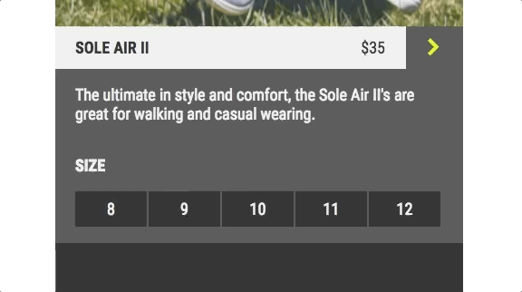
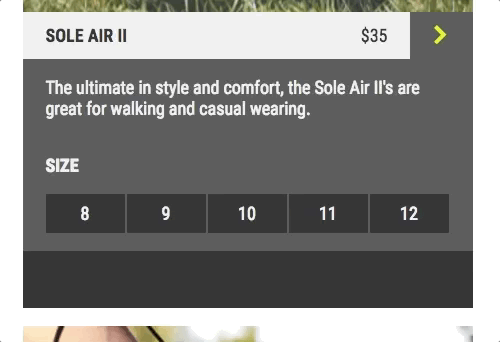

# Learn jQuery: Effects

## .hide()
The first tool you will add to your jQuery effects tool belt is the .hide() method. When you hide an element, your browser will render the HTML as if the hidden element does not exist. It will disappear from the page and the space that it was taking up will disappear as well. Take a look at the code below to learn how to use the .hide() method:
```JS
$('.hide-arrow').on('click', () => {
  $('.shoe-information').hide();
});
```

In the example above, the event handler gets triggered whenever an element with a class of hide-arrow is clicked. That element could be a button, some text, an image, or any other HTML element. When the event is triggered, we target all elements of the class shoe-information and call .hide() on them. Check out the gif below to see an example.



## .show()
Now that we’ve learned how to hide elements on our page, we want to know how to make them reappear. Luckily, the .show() method does the opposite of .hide(). If an element on your page is hidden, .show() will make it appear.
```JS
$('.show-arrow').on('click', () => {
  $('.shoe-information-2').show();
});
```
The code above should look similar to the code you wrote using .hide(). The only difference is that we are calling a different method on the targeted elements. This time we are calling the .show() method on the shoe’s textual information.

Check out the gif below to see .show() in action!


## .toggle()
Great work! Our table now has two buttons that hide and show our image. But wouldn’t it be nice to have one button do both? It is common for web pages to have one button that will either hide or show elements depending on their current state. We can achieve this by using the .toggle() method.
```JS
$('.toggle-button').on('click', () => {
  $('.shoe-information-3').toggle();
});
```


## fading



In this gif, the .fadeIn() method is called on an HTML element. Instead of instantly showing the element, .fadeIn() and .fadeOut() make the element appear or disappear over a given period of time. You can think of this as an animation. The transition between being visible and invisible happens over a duration of time.

Both .fadeIn() and .fadeOut() take an optional parameter that specifies how long the animation will take. For example, in the code below, all \<div> elements will fade out over a period of 1000 milliseconds (or one second).
```JS
$('div').fadeOut(1000);
```

In the example above, the 1000 argument is optional; you don’t need to put a number between the parentheses. This number represents the number of milliseconds it takes for the animation to complete. If no argument is given, the default animation duration is 400 milliseconds.

## .fadeToggle()
Great work! With fade, our website is starting to look dynamic. .fadeToggle() is the third and final method in this trio of fade methods. This method is similar to .toggle(). If you call .fadeToggle() on an element that is invisible, it will fade in. And if the element is already visible, then .fadeToggle() will make it fade out.

Like the other fade methods, .fadeToggle() can take an argument that sets the duration of the effect.
```JS
$('div').fadeToggle(1000);
```
In the example above, all div elements will fade in or out over a period of 1000 milliseconds. Hidden div elements will fade in, and visible div elements will fade out.

## Sliding
By using sliding effects, an element on your web page will slide up or down into place instead of appearing or disappearing. Just like with the other effects, sliding can be applied to any element on your page whether it be an image, a video, or text.

Sliding methods are animations; they happen over a period of time. As a result, sliding methods have an optional parameter to determine how long the animation will take.
```JS
$('.menu-button').on('click', () => {
  $('.menu-content').slideDown('slow');
});
```
In the above code, we call the .slideDown() method on the elements of class menu-content whenever menu-button elements are clicked. The slow parameter determines the speed of the animation. That code will produce something that looks like this:


## Review: Effects
Wow! You’ve completed this table of 9 different jQuery effects. Great job! To review, the methods that we learned were:
* .hide()
* .show()
* .toggle()

These methods instantly hide or show elements on a web page.
* .fadeOut()
* .fadeIn()
* .fadeToggle()

These methods make elements disappear or appear over a given period of time.
* .slideUp()
* .slideDown()
* .slideToggle()

These methods make elements slide up or down into place over a given period of time.

```JS
$(document).ready(() => {
  // .hide()
  $('.hide-button').on('click', () => {
    $('.first-image').hide();
  });
  // .show()
  $('.show-button').on('click', () => {
    $('.first-image').show();
  });
  // .toggle()
  $('.toggle-button').on('click', () => {
    $('.first-image').toggle();
  });
  // .fadeOut()
  $('.fade-out-button').on('click', () => {
    $('.fade-image').fadeOut(500);
  });
  // .fadeIn()
  $('.fade-in-button').on('click', () => {
    $('.fade-image').fadeIn(4000);
  });
  // .fadeToggle()
  $('.fade-toggle-button').on('click', () => {
    $('.fade-image').fadeToggle();
  });
  // .slideUp()
  $('.up-button').on('click', () => {
    $('.slide-image').slideUp(100);
  });
  // .slideDown()
  $('.down-button').on('click', () => {
    $('.slide-image').slideDown('slow');
  });
  // .slideToggle()
  $('.slide-toggle-button').on('click', () => {
    $('.slide-image').slideToggle(400);
  });
});
```