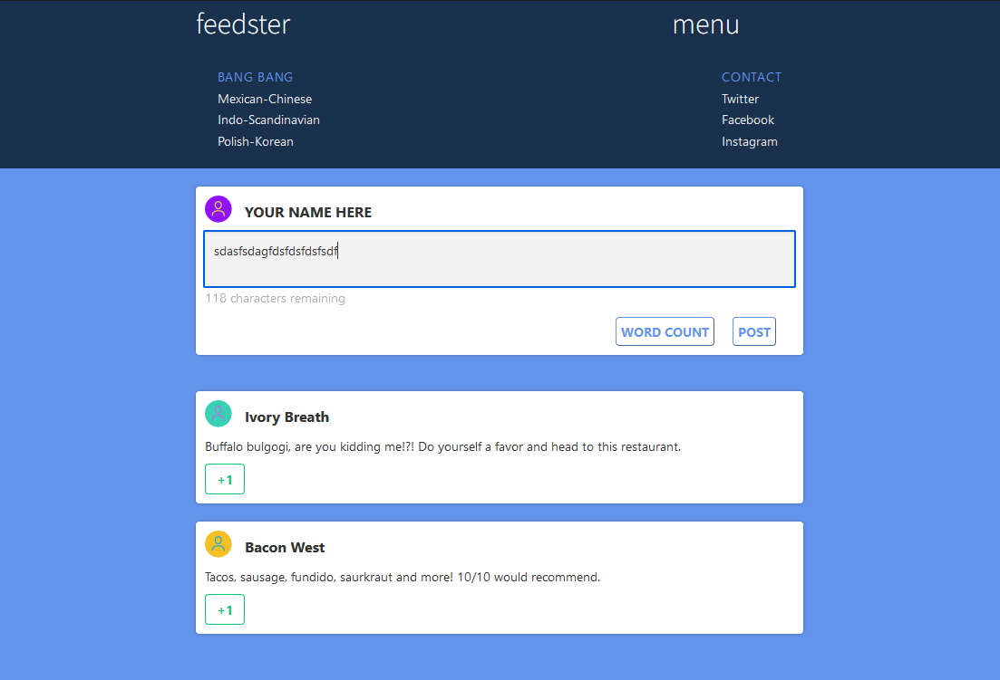

# Feedster
In this project, you will help feedster add dynamic behavior to their website. They need help adding hover functionality to their navigation menu and buttons.

If you’re up for a challenge, feedster also wants help limiting their users’ posts to 140 characters or less. You’ll need to use the jQuery documentation to figure out how to implement this using the jQuery keyup method!

If you get stuck during this project or would like to see an experienced developer work through it, click “Get Unstuck“ to see a [project walkthrough video](https://www.youtube.com/watch?v=6qIEyC23PSM).



## Add Hover Functionality to the Navigation Menu
1. In the next two steps, you will make a navigation menu appear when you hover over menu, and make it disappear when you navigate away from the navigation menu.

    Add an event handler to main.js that shows the .nav-menu element when a user mouses over the .menu element.
2. Add an event handler to main.js that hides the .nav-menu element when a user’s mouse leaves the .nav-menu element.
3. In the next three steps, you will add hover functionality to the +1 button elements.

    Add an event handler to main.js that adds the .btn-hover class to .btn elements when a user mouses over a .btn element.
4. Chain a mouse leave event handler to the mouse enter event handler you added the last step.

    Inside the callback function, remove the .btn-hover class from .btn.
5. There are multiple +1 buttons, and we only want the current button to change when a user’s mouse enters and leaves.

    Change the .btn callback functions so only the current button is impacted by mouse enter and mouse leave events.

## Limit a User's Post to 140 Characters
6. feedster wants to display the remaining number of characters that a user can enter into their comment box.

    Each time the user types a letter, we want to change the character count. For this we can use the keyup event listener.

    In main.js, use the .on() method to add a keyup event listener to the '.postText' element. Leave the callback function empty until the next step.
7. In main.js, call jQuery’s .focus() method on '.postText'. This will cause the <textarea> to expect typed text as soon as the page loads.
8. After each keyup event, we want to count the number of characters in the new post.

    Add an event argument to the keyup event listener’s callback function.

    Inside the callback function, declare a variable called post and set it equal to $(event.currentTarget).val(). This will set post equal to the string inside the .postText element.
9. Now let’s use a bit of JavaScript and math to determine the number of characters a user has left for their comment.

    Under the post variable, declare another variable called remaining and set it to 140 minus the length of post.
10. Now that we know how many characters the user has left, we need to update that number in the HTML.

    Still in the keyup callback function, add the following jQuery code.
    ```JS
    $('.characters').html(remaining);
    ```

    The code above will update the number of characters remaining.

    Run the code and try typing a new post. You should see the character number change after each keystroke.
11. To finish, let’s make the '.wordcount' message turn red if the user runs out of characters. To do this, we will use a simple if/else statement.

    Under the remaining variable declaration, add an if statement with a condition of remaining <=0. If remaining is less than or equal to 0, use the addClass method to give '.wordcount' a class of 'red'.
12. Finally, add an else statement to the if condition you just created. If the value of remaining is above 0, remove the 'red' class from '.wordcount'.
13. Now try it out! Type a message and go over the 140 character count limit to see the message turn red.

    Then shorten the message and the word count message should return to black.
