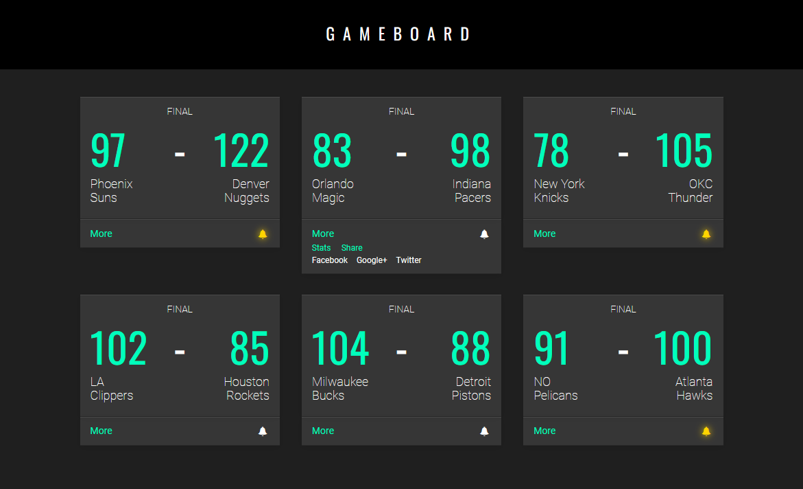

# Gameboard
Gameboard is creating a scoreboard that displays NBA scores from around the league. They want the user to be able to click the More link to see the dropdown menu, to click the Share link to see the share menu, and to click the notification bell.

If you get stuck during this project or would like to see an experienced developer work through it, click “Get Unstuck“ to see a [project walkthrough video](https://www.youtube.com/watch?v=Jml4eShR5O8).

1. Look at index.html:

    In the \
, there are two elements: an \<a class="more-btn"> and a \<ul class="more-menu">. When the \<a> is clicked, we want the \<ul class="more-menu"> to appear.

    Inside the \<ul class="more-menu">, there are two elements: an \<li class="share"> and a \<li class="share-menu">. When the \<li class="share"> is clicked, we want the \<li class="share-menu"> to appear.

    There is a \ element. When that element is clicked, we want the notification bell to turn yellow.
2. In script.js, attach a click event handler to the \<a class="more-btn"> element.

    When clicked, toggle the sibling \<ul class="more-menu"> element.
3. Attach a click event handler to the \<li class="share"> element. When clicked, toggle the corresponding \<li class="share-menu"> element.
4. Attach a click event handler to the notification bell. When clicked, toggle the class active.
5. Click here for a video walkthrough from our experts to help you check your work!
